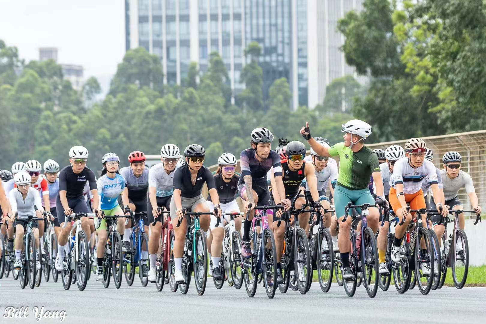

---
# You can also start simply with 'default'
theme: seriph
# random image from a curated Unsplash collection by Anthony
# like them? see https://unsplash.com/collections/94734566/slidev
# background: https://cover.sli.dev
background: /bg.jpg
# some information about your slides (markdown enabled)
title: Welcome to Slidev
info: |
  ## Slidev Starter Template
  Presentation slides for developers.

  Learn more at [Sli.dev](https://sli.dev)
# apply unocss classes to the current slide
class: text-center
# https://sli.dev/custom/highlighters.html
highlighter: shiki
# https://sli.dev/guide/drawing
drawings:
  persist: false
# slide transition: https://sli.dev/guide/animations#slide-transitions
transition: slide-left
# enable MDC Syntax: https://sli.dev/guide/syntax#mdc-syntax
mdc: true
---

# VV Bike

## 创建及发展历程

—— VV Bike

---

# 第 2 页

## 在茂名艰难地生存了几年

（本页内容需要重新编辑）

---

# 迁至珠海发展的理由

 

- **地理位置** - 临近港澳广深

- **客群广袤** - 生活节奏相对较慢，年轻人多，潜在客群广袤

- **骑行条件** - 珠海唐家湾有狭长的海岸线公路，骑行条件良好

- **骑友资源** - 珠海骑友群较为活跃，人数较多

- **市场竞争** - 当时唐家湾没有运动自行车店

- **市场资源** - 更容易获得品牌方关注

---

# 五月花店

<section class="flex justify-between items-center">

Okk

</section>

---

# XX 店

---

# 金山店

 
<section class="flex justify-between items-center">

- 目前与国际顶尖的骑行品牌合作

- 提供了全国首屈一指的骑行场所

- 经营业务囊括*销售、维保、批发、培训、活动筹办*

</section>

---

# 销售

# 维保

# 批发

# 培训

